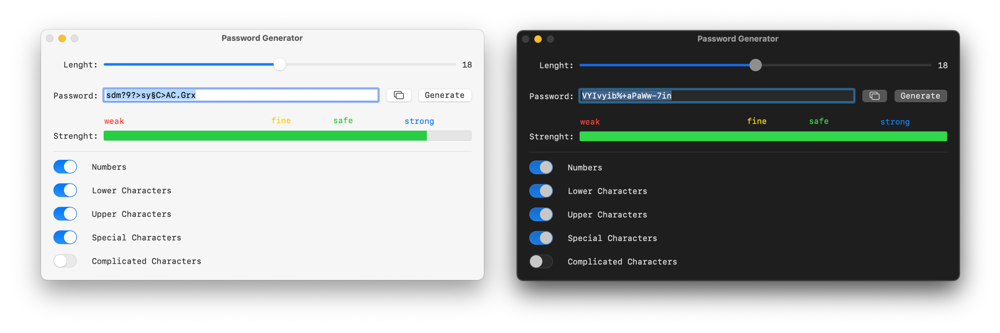

# Password-Generator
Password generator and strength tester

## Description

This is a project for generating passwords and testing their strength. The program tests the strength by rating it by the **number of characters**, the **selection of characters** and the **diversity of the used characters**. Additionally it searches for the password in the list of the **10.000.000 most common** passwords and warns the user in the case, that it matches one in the list.

## Disclaimer

This is no professional password generation or testing and **I do not guarantee for the security**. This is just meant to help overcome the bad habit of using weak passwords.

## Building the application

Just download and open the Xcode-Project and build the project as usual.

The project was developed under MacOS Monterey, Xcode 13.2.1 and Swift 5.

## The developer

I am Frederik Mrozek (DL6FM) and the developer of this project.
